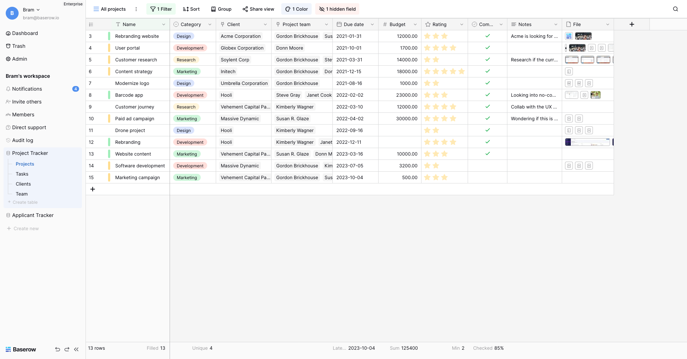

## Fwego is a no-code database tool and an Airtable alternative.

Create your own online database without technical experience. Our user-friendly no-code
tool gives you the powers of a developer without leaving your browser.

* A spreadsheet database hybrid combining ease of use and powerful data organization.
* Easily self-hosted with no storage restrictions or sign-up on https://fwego.io to
  get started immediately.
* Alternative to Airtable.
* Open-core with all non-premium and non-enterprise features under
  the [MIT License](https://choosealicense.com/licenses/mit/) allowing commercial and
  private use.
* Headless and API first.
* Uses popular frameworks and tools like [Django](https://www.djangoproject.com/),
  [Vue.js](https://vuejs.org/) and [PostgreSQL](https://www.postgresql.org/).

[](https://heroku.com/deploy?template=https://github.com/bram2w/fwego/tree/master)

```bash
docker run -v fwego_data:/fwego/data -p 80:80 -p 443:443 digitranslab/fwego:1.30.1
```



## Get Involved

**We're hiring remotely**! More information at https://fwego.io/jobs.

Join our forum at https://community.fwego.io/. See
[CONTRIBUTING.md](./CONTRIBUTING.md) on how to become a contributor.

## Installation

* [**Docker**](docs/installation/install-with-docker.md)
* [**Ubuntu**](docs/installation/install-on-ubuntu.md)
* [**Docker Compose** ](docs/installation/install-with-docker-compose.md)
* [**Heroku**: Easily install and scale up Fwego on Heroku.](docs/installation/install-on-heroku.md)
* [**Render**: Easily install and scale up Fwego on Render.](docs/installation/install-on-render.md)
* [**Digital Ocean**: Easily install and scale up Fwego on Digital Ocean.](docs/installation/install-on-digital-ocean.md)
* [**Cloudron**: Install and update Fwego on your own Cloudron server.](docs/installation/install-on-cloudron.md)
* [**Railway**: Install Fwego via Railway.](docs/installation/install-on-railway.md)
* [**Elestio**: Fully managed by Elestio.](https://elest.io/open-source/fwego)

## Official documentation

The official documentation can be found on the website at https://fwego.io/docs/index
or [here](./docs/index.md) inside the repository. The API docs can be found here at
https://api.fwego.io/api/redoc/ or if you are looking for the OpenAPI schema here
https://api.fwego.io/api/schema.json.

## Become a sponsor

If you would like to get new features faster, then you might want to consider becoming a
sponsor. By becoming a sponsor we can spend more time on Fwego which means faster
development.

[Become a GitHub Sponsor](https://github.com/sponsors/bram2w)

## Development environment

If you want to contribute to Fwego you can setup a development environment like so:

```
$ git clone https://github.com/digitranslab/fwego.git
$ cd fwego
$ ./dev.sh --build
```

The Fwego development environment is now running.
Visit [http://localhost:3000](http://localhost:3000) in your browser to see a working
version in development mode with hot code reloading and other dev features enabled.

More detailed instructions and more information about the development environment can be
found
at [https://fwego.io/docs/development/development-environment](./docs/development/development-environment.md)
.

## Plugin development

Because of the modular architecture of Fwego it is possible to create plugins. Make
your own fields, views, applications, pages, or endpoints. We also have a plugin
boilerplate to get you started right away. More information can be found in the
[plugin introduction](./docs/plugins/introduction.md) and in the
[plugin boilerplate docs](./docs/plugins/boilerplate.md).

## Meta

Created by Digitrans Inc. - developers@digi-trans.org.

Distributes under the MIT license. See `LICENSE` for more information.

Version: 1.30.1

The official repository can be found at https://github.com/digitranslab/fwego.

The changelog can be found [here](./changelog.md).

Become a GitHub Sponsor [here](https://github.com/sponsors/bram2w).
